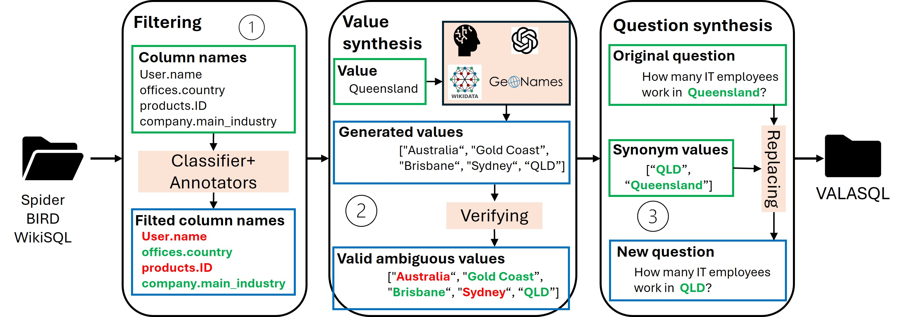

# VALASQL
An Extensible Benchmark for Value Ambiguity Resolution in Text-to-SQL

#### Overview

Text-to-SQL systems allow users to query databases through natural language, but their reliability is often limited by ambiguity. While column ambiguity caused by overlapping semantics between database columns and the user's intended query target, has been thoroughly studied, value ambiguity, where user references such as synonyms or abbreviations differ from stored database values, remains underexplored. To address this gap, we introduce VALASQL (Value Ambiguity in Text-to-SQL), a dataset constructed from BIRD, Spider, and WikiSQL benchmarks, designed to systematically evaluate value ambiguity and provide a new testbed for advancing robust Text-to-SQL research. In addition, we propose a framework that guides existing models to better recognize and resolve value ambiguity, establishing both a novel benchmark and a practical pathway toward more robust Text-to-SQL systems.

#### Data Generation
<div align="center">
  
</div>

The [`generate_data/`](generate_data/) directory contains a 7-step pipeline (Step 1-1 → 3-2) that filters datasets, generates synonym values via LLM, and updates databases and SQL queries. See [`generate_data/README.md`](generate_data/README.md) for full instructions.

#### Citation
```
@inproceedings{pham2025extensible,
  title={An Extensible Benchmark for Value Ambiguity Resolution in Text-to-SQL},
  author={Pham, Minh Tam and Nguyen, Quoc Viet Hung and Jo, Jun and Nguyen, Thanh Tam},
  booktitle={Australasian Database Conference},
  pages={124--138},
  year={2025},
  organization={Springer}
}
```
